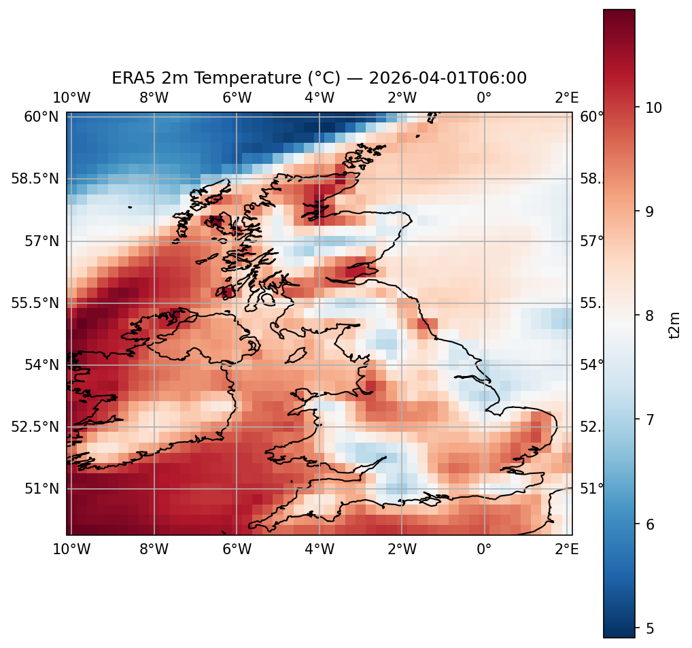

# ERA5 Meteorological Data Exploration

Exploring ERA5 reanalysis data from the Copernicus Climate Data Store (CDS) using Python. This project covers downloading, opening, inspecting and plotting gridded meteorological data in both NetCDF and GRIB formats.

## What this project covers

- Downloading ERA5 data via the CDS API in NetCDF and GRIB formats
- Opening and inspecting data using `xarray` and `cfgrib`
- Plotting 2m temperature over the UK using `matplotlib` and `cartopy`

## Example output



## Scripts

- `download_era5_nc.py` — downloads ERA5 2m temperature as NetCDF
- `download_era5_grib.py` — downloads the same data as GRIB
- `explore_era5_nc.py` — opens and inspects the NetCDF file
- `explore_era5_grib.py` — opens and inspects the GRIB file

## Setup

```bash
python3 -m venv venv
source venv/bin/activate
pip install cdsapi xarray cfgrib matplotlib cartopy netCDF4 eccodes
```

You will also need a free CDS account and API key — see [Copernicus CDS](https://cds.climate.copernicus.eu).